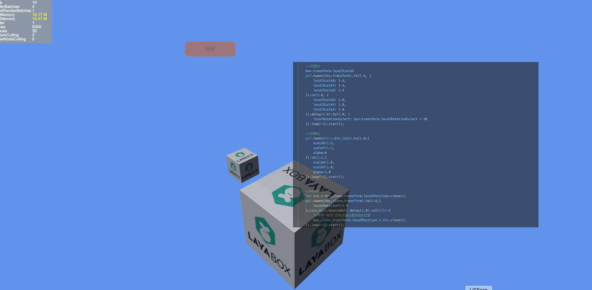

<!--
 * @Description: 
 * @Autor: geek7
 * @Version: 1.0
 * @Date: 2022-01-20 15:58:45
 * @LastEditors: geek7
 * @LastEditTime: 2022-02-07 18:43:48
-->
# EasyTween
**支持2D&3D**



## 更清晰的写法
```typescript

    gk7.tween(cube).to(1.0,{
        localRotationEulerY:360
    }).loop(-1).start();

```


## 更少的代码量
```typescript

    gk7.tween(this.btn_test).to(1.0,{
        scaleX:1.2,
        scaleY:1.2,
        alpha:0
    }).to(1.2,{
        scaleX:1.0,
        scaleY:1.0,
        alpha:1.0
    }).loop(-1).start();
```

## 同时支持Laya内部缓动
```typescript

    let src = box_clone.transform.localPosition.clone();
    gk7.tween(box_clone.transform).to(1.0,{
        localPositionY:1.0
    },Laya.Ease.bounceOut).delay(1.0).call(()=>{
        //等待一秒后 回调设置位置到起始位置
        box_clone.transform.localPosition = src.clone();
    }).loop(-1).start();
```